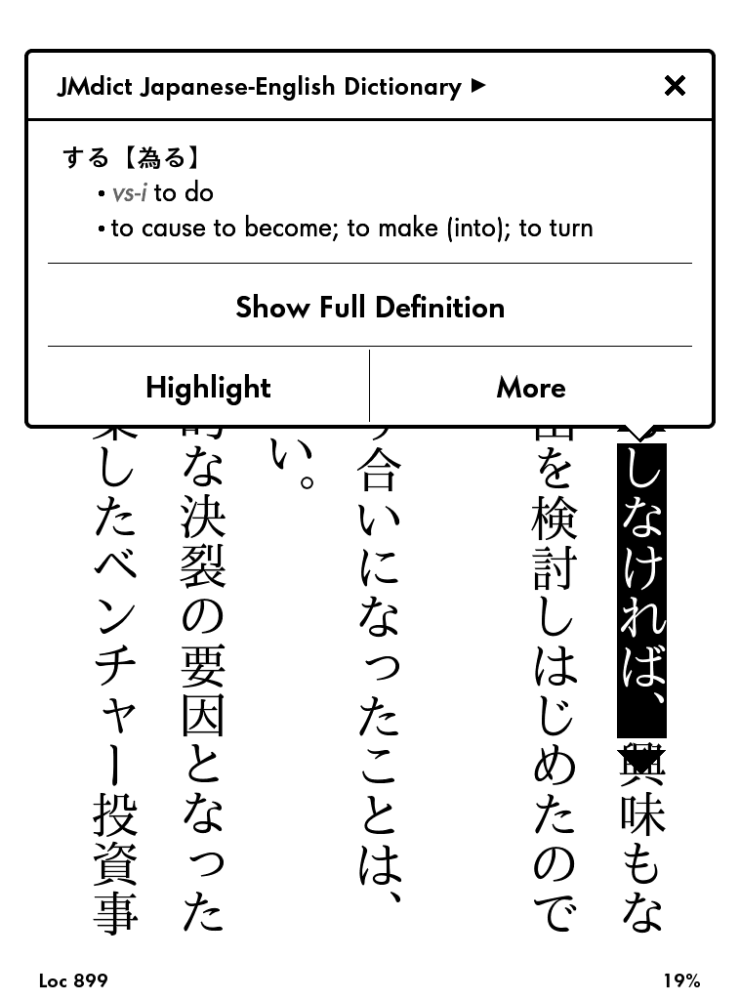

About
=====

This is a Japanese-English dictionary based on the
[JMdict](http://www.edrdg.org/jmdict/j_jmdict.html) database for
_e-Ink_ Kindle devices.

Features:

* lookup of inflected verbs.

<!--
Screenshots were captured inside the Kindle device as explained in
http://blog.blankbaby.com/2012/10/take-a-screenshot-on-a-kindle-paperwhite.html
then processed with ImageMagick's
`mogrify -colorspace gray -level 0%,111.11% -define PNG:compression-level=9`
to look like E-Ink display.
-->

Supported Devices
=================

The dictionary has been tested on _Kindle Paperwhite_.  It _should_ also work
well with other _e-Ink_ Kindle devices that were released after _Paperwhite_,
such _Kindle Voyage_, _Kindle Oasis_, and newer generations of _Kindle_.

The dictionary will *not* work well on _Kindle Fire_ or _Kindle Android App_,
or any Android based Kindle, because the Kindle software on those platforms
does not support inflection lookups.

Download
========

You can download the latest version of the dictionary from
[here](https://github.com/jrfonseca/jmdict-kindle/releases).

Install
=======

_e-Ink_ Kindle
-----------------

To install the dictionary into your device follow these steps:

* for 1st-generation Kindle Paperwhite devices, ensure you have
  [firmware version 5.3.9 or higher](http://www.amazon.com/gp/help/customer/display.html/ref=hp_left_cn?ie=UTF8&nodeId=201064850)
  as it includes improved homonym lookup for Japanese;

* connect your Kindle device via USB;

* copy the `jmdict.mobi` to the `documents` sub-folder;

* eject the USB device;

* on your device go to
  _Home > Settings > Device Options > Language and Dictionaries > Dictionaries_
  and set _JMdict Japanese-English Dictionary_ as the default dictionary for
  Japanese.

Kindle Android App
------------------

**NOTE: Unfortunately the Kindle Android App does not support dictionary inflections, yielding verbs lookup practically impossible. No known workaround.**

* rename `jmdict.mobi` as `B005FNK020_EBOK.prc`

* connect your Android device via USB

* copy `B005FNK020_EBOK.prc` into `Internal Storage/Android/data/com.amazon.kindle/files/` or `/sdcard/android/data/com.amazon.kindle/files`

This will override the
[default Japanese-Japanese dictionary](https://kindle.amazon.com/work/daijisen-x5927-x8f9e-japanese-edition-ebook/B005FNK020/B005FNK020).

Building from source
====================

Requirements:

* Unix (tested with Linux but might work on MacOS or Cygwin with little or no changes)

* Python version 2.7

  * [Pycairo Python](http://www.cairographics.org/pycairo)

  * [Python Image Library](http://www.pythonware.com/products/pil/)

* [kindlegen](http://www.amazon.com/gp/feature.html?docId=1000765211) (tested with version 2.9)

Build with:

    make

To do
=====

* Leverage more of the JMdict data:

  * cross references

* Add examples from [Tanaka Corpus](http://www.edrdg.org/wiki/index.php/Tanaka_Corpus#Downloads) or [Tatoeba project](http://tatoeba.org/eng/downloads).

* Include a subset of Japanese proper names from [ENAMDICT/JMnedict](http://www.csse.monash.edu.au/~jwb/enamdict_doc.html).

Credits
=======

* Jim Breen and the [JMdict/EDICT project](http://www.edrdg.org/jmdict/j_jmdict.html)

* John Mettraux for his [EDICT2 Japanese-English Kindle dictionary](https://github.com/jmettraux/edict2-kindle)

* Choplair-network for their [Nihongo conjugator](http://www.choplair.org/?Nihongo%20conjugator)

Alternatives
============

* [John Mettraux's EDICT2 Japanese-English Kindle dictionary](https://github.com/jmettraux/edict2-kindle)

* [Amazon Kindle Store](http://www.amazon.com/s/url=search-alias%3Ddigital-text&field-keywords=japanese+english+dictionary)
