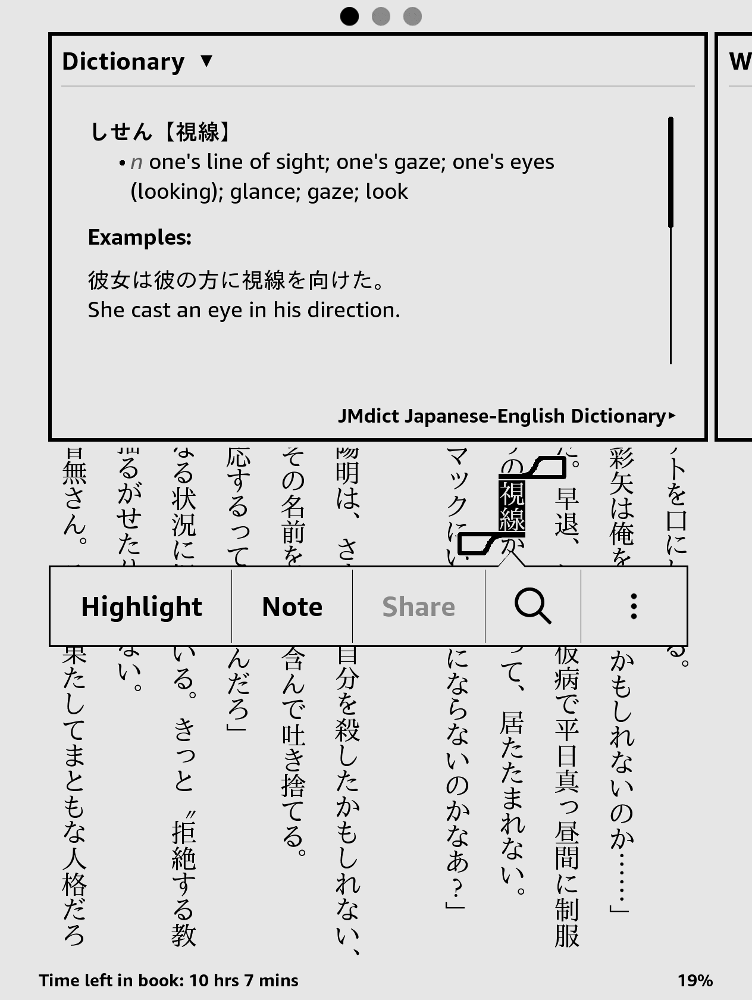
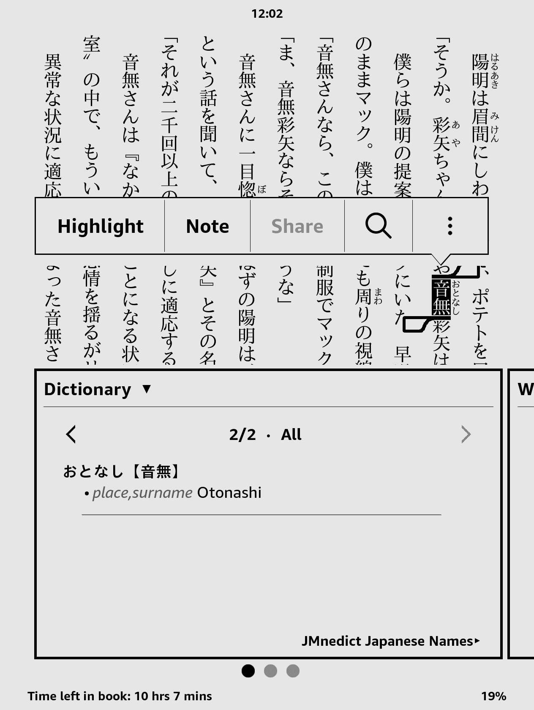

About
=====

This is a Japanese-English dictionary based on the
[JMdict](http://www.edrdg.org/jmdict/j_jmdict.html) and [JMnedict](https://www.edrdg.org/enamdict/enamdict_doc.html) and [Tatoeba](https://tatoeba.org/) database for
_e-Ink_ Kindle devices.

Features:

* lookup of inflected verbs.
* lookup for Japanese names.
* the dictionaries can be downloaded as separate files or as one big dictionary (the combined dictionary does not include example sentences due to file size restrictions)

<!--
Screenshots were captured inside the Kindle device as explained in
http://blog.blankbaby.com/2012/10/take-a-screenshot-on-a-kindle-paperwhite.html
then processed with ImageMagick's
`mogrify -colorspace gray -level 0%,111.11% -define PNG:compression-level=9`
to look like E-Ink display.
-->





Supported Devices
=================

The dictionary has been tested on _Kindle Paperwhite_ and _Kindle Oasis_.  It _should_ also work
well with other _e-ink_ Kindle devices

The dictionary will *not* work well on _Kindle Fire_ or _Kindle Android App_,
or any Android based Kindle, because the Kindle software on those platforms
does not support inflection lookups.


Download
========

You can download the latest version of the dictionary from
[here](https://github.com/jrfonseca/jmdict-kindle/releases).


Install
=======

_e-Ink_ Kindle
-----------------

There are in total 3 dictionaries:

* jmdict.mobi: Contains only data from the JMedict database. It does not contain words
* jmnedict.mobi: Contains only names from the JMnedict databse
* combined.mobi: Contains the data from both of the above dictionaries

To install any of the dictionaries (you can also install all three of them) into your device follow these steps:

* for 1st-generation Kindle Paperwhite devices, ensure you have
  [firmware version 5.3.9 or higher](http://www.amazon.com/gp/help/customer/display.html/ref=hp_left_cn?ie=UTF8&nodeId=201064850) as it includes improved homonym lookup for Japanese;
* connect your Kindle device via USB;
* copy the the `.mobi` file for the dictionary you want to use to the `documents` sub-folder;
* eject the USB device;
* on your device go to
  _Home > Settings > Device Options > Language and Dictionaries > Dictionaries_
  and set _JMdict Japanese-English Dictionary_ as the default dictionary for
  Japanese.

Kindle Android App
------------------

**NOTE: Unfortunately the Kindle Android App does not support dictionary inflections, yielding verbs lookup practically impossible. No known workaround.**

* rename `jmdict.mobi` or any of the other two dictionaries as `B005FNK020_EBOK.prc`

* connect your Android device via USB

* copy `B005FNK020_EBOK.prc` into `Internal Storage/Android/data/com.amazon.kindle/files/` or `/sdcard/android/data/com.amazon.kindle/files`

This will override the
[default Japanese-Japanese dictionary](https://kindle.amazon.com/work/daijisen-x5927-x8f9e-japanese-edition-ebook/B005FNK020/B005FNK020).


Building from source
====================

Requirements:

* Linux or Windows with Cygwin (might also work on macOS with a few changes)
* Python version 3

  * [Pycairo Python](http://www.cairographics.org/pycairo)
  * [Pillow](http://pillow.readthedocs.io/en/latest/)
  * [htmlmin](https://htmlmin.readthedocs.io/en/latest/index.html)

Inside of the makefile you can change the max number of sentences per entry, compression, as well as which sentences to include:

```markdown
# The Kindle Publishing Guidelines recommend -c2 (huffdic compression),
# but it is excruciatingly slow. That's why -c1 is selected by default.
COMPRESSION ?= 1
# Sets the max sentences per entry only for the jmdict.mobi.
# It is ignored by combined.mobi due to size restrictions.
# If there are too many sentences for the combined dictionary,
# it will not build (exceeds 650MB size limit).
SENTENCES ?= 5
# This flag determines wheter only good and verified sentences are used in the
# dictionary. Set it to TRUE if you only want those sentences.
# It is only used by jmdict.mobi.
# It is ignored bei combined.mobi. there it is always true
# this is due to size constraints.
ONLY_CHECKED_SENTENCES ?= FALSE
```

Build with make to create all 3 dictionaries:
```
make
```
or use any of the following commands to create a specific one:
```
make jmdict.mobi
make jmnedict.mobi
make combined.mobi
```

Please be aware that as of now the combined dictionary does not contain example sentences as this would push the `mobi` beyond the file size limit

To do
=====

* Leverage more of the JMdict data:

  * cross references
* Add Furigana to example sentences
* Create proper covers
* Find a way to have sentences in the combined dictionary (maybe less names). The size limit for `mobi` of 650MB is reached quite fast


Credits
=======

* Jim Breen and the [JMdict/EDICT project](http://www.edrdg.org/jmdict/j_jmdict.html) as well as the [ENAMDICT/JMnedict](https://www.edrdg.org/enamdict/enamdict_doc.html)
* The [Tatoeba](https://tatoeba.org/) project
* John Mettraux for his [EDICT2 Japanese-English Kindle dictionary](https://github.com/jmettraux/edict2-kindle)
* Choplair-network for their [Nihongo conjugator](http://www.choplair.org/?Nihongo%20conjugator)


Alternatives
============

* [John Mettraux's EDICT2 Japanese-English Kindle dictionary](https://github.com/jmettraux/edict2-kindle)

* [Amazon Kindle Store](http://www.amazon.com/s/url=search-alias%3Ddigital-text&field-keywords=japanese+english+dictionary)
